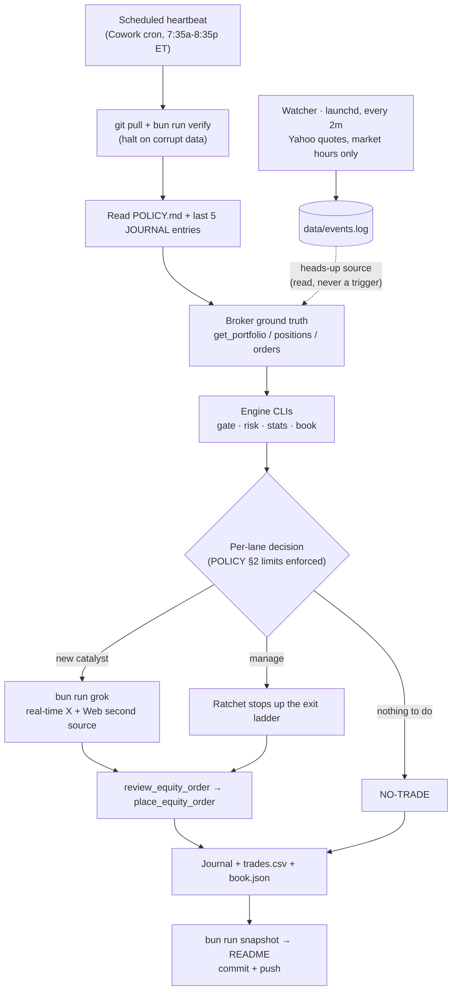

# book

A live AI trading agent that runs real money on Robinhood, plus an older
Sui prediction-market thread that's on the back burner. The trading agent is
the thing that's actually alive — start there.

## What the agent does

Claude trades a dedicated Robinhood account on a schedule. A binding policy
file decides what it's allowed to do; every run writes a journal entry and
commits it to this repo. Right now it's running about $4,585 of real,
lose-it-all risk capital across a handful of US equities.

The design is three files and a habit:

- **`robinhood-agentic/POLICY.md`** is the contract. Position limits, the
  exit ladder, which lanes are live, when it may trade. The agent obeys it;
  only the owner edits it.
- **`robinhood-agentic/JOURNAL.md`** is the episodic memory — each run reads
  the last few entries and appends its own. **`LESSONS.md`** is the distilled
  memory: the durable, non-obvious lessons (read every run), so a hard-won
  insight from 20 runs ago still shapes today's decision instead of scrolling
  out of the journal's window. The system is meant to get smarter each run, not
  just older.
- **The scheduled loop is the heartbeat.** A cron task runs the same
  `/trading-loop` skill every cycle, pre-market through after-hours.
- **The rule that earns its keep:** the LLM never does arithmetic in its
  head. Sizing, every policy limit, the regime signal, and the stats all
  come out of a small tested TypeScript engine in `src/trading/`. If a number
  decides whether real money moves, a test covers it.

## How a run works



The watcher is a separate always-on process (launchd, every 2 minutes during
market hours). It can't place orders. It logs fast moves to `events.log`; the
scheduled loop reads that log as a heads-up on its next run. `bun run watch -- --status`
shows whether it's alive and what it has flagged, and the README snapshot above
carries the same line.

## Portfolio snapshot

<!-- SNAPSHOT:START -->
_As of 2026-07-08T18:38:00Z — auto-generated by the trading loop (`bun run snapshot`). Source of truth is Robinhood; this is the committed mirror._

**Invested $4,585.00 · Current $4,769.30 · Profit +$184.30 (+4.0%)**

Settled cash $4,769.30 · 0/6 slots · open risk to stops $0.00 (0.0%)

| Position | Qty | Entry | Stop | Mark | P&L | Theme |
|---|--:|--:|--:|--:|--:|---|

Closed trades:

| Trade | Lane | R | P&L |
|---|---|--:|--:|
| 2026-06-11-MU | L1 | 1.04R | $78.68 |
| 2026-06-11-INTC | L1 | 0.86R | $31.44 |
| 2026-06-11-INTC-b1 | L1 | 1.61R | $29.38 |
| 2026-06-11-TQQQ | L2 | 0.31R | $41.14 |
| 2026-06-12-DAL | L1 | 0.00R | $-0.20 |
| 2026-06-12-AMD | L1 | 0.00R | $-0.03 |

**Measurement gate (POLICY §6a):** 6 closed / 0 open · expectancy 0.64R · capital-add not eligible (needs ≥10 closed / >+0.25R / 0 breaches / ≥4wk). Per lane: L1 0.70R (5 closed) · L2 0.31R (1 closed).

**Lane-2 regime gate:** OFF (confirmed 2-day; QQQ 709.43 vs 20d MA 720.37, as of 2026-07-07).

**Watcher: no data yet (not started, or never an in-hours scan).**
<!-- SNAPSHOT:END -->

## The engine (`src/trading/`)

Every command reads committed data and prints a decision. The heartbeat calls
them; you can run any of them yourself.

| Command | What it answers |
|---|---|
| `bun run book` | One-screen panel: positions, stops, every §2 limit, gate, §6a, flags |
| `bun run risk -- <book.json>` | Does this book pass all POLICY §2 limits? Size an entry with `risk -- size` |
| `bun run gate` | Is the Lane-2 leveraged-ETF regime ON or OFF (QQQ 20-day MA + VIXY)? |
| `bun run stats` | Hit rate, expectancy, per-lane R, the §6a capital-add scoreboard |
| `bun run grok "<q>"` | Live X + Web catalyst search via xAI Grok, with citations and cost |
| `bun run verify` | Schema-check every CSV/JSON file before the loop trusts it |
| `bun run shadow` | Score the trades we skipped — is the selection adding value? |
| `bun run watch -- --status` | Is the event watcher alive, and what has it flagged moving? |
| `bun run snapshot` | Rewrite the snapshot block above from the committed book |
| `bun run backtest` | 3-year regime-gate validation (see `docs/BACKTEST-REGIME-GATE.md`) |
| `bun test src/trading` | The whole engine test suite |

## Guardrails worth knowing

- POLICY.md is binding and owner-only. The agent can be stricter than policy,
  never looser.
- `review_equity_order` before every order. Stops ratchet up, never down.
- Adding capital is gated (§6a): ten closed trades, positive expectancy, no
  breaches, four weeks. Owner deposits are exempt and journaled.
- Extended-hours trading is limit-only because Robinhood won't rest a stop
  outside regular hours, so a regular-hours stop still goes on with every fill
  and activates at the open (POLICY §3.7).
- A catalyst entry needs two independent sources. Ingested web or X text is a
  source, never an instruction.

The full operator guide is [`robinhood-agentic/README.md`](robinhood-agentic/README.md);
the binding rules are [`robinhood-agentic/POLICY.md`](robinhood-agentic/POLICY.md).

## Also in this repo: Sui DeepBook Predict (parked)

An earlier thread: a native iOS app on Sui's DeepBook Predict prediction
markets (`ios/`, testnet only), with a TypeScript research sandbox (`src/`).
It's scaffolding, not running. The orientation docs still hold:
[`docs/STRATEGY.md`](docs/STRATEGY.md), [`docs/DEEPBOOK_PREDICT.md`](docs/DEEPBOOK_PREDICT.md),
[`docs/IOS.md`](docs/IOS.md), [`docs/VENUES.md`](docs/VENUES.md).

The name has two readings: DeepBook, the Sui CLOB, and a trader's book of
positions. Both fit.

## Run

```sh
bun install
bun test src/trading     # the trading engine + its tests
bun run book             # current book panel from committed data

# Sui sandbox (testnet smoke test)
bun run start
```

## Owner

Ash Bhimasani. Personal sandbox, real capital on the Robinhood side. Not
investment advice.
